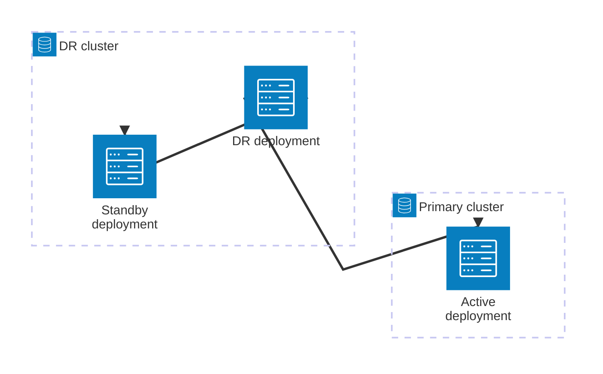
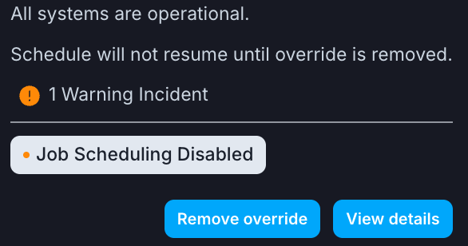

# disaster_recovery_dags_af3

DAGs for user-level DR replication and failover in Airflow 3 using Starship

## Overview



### Clusters

* **Primary**: The primary cluster which hosts active deployments under normal circumstances.
* **DR**: The disaster recovery cluster which hosts standby deployments and is expected to remain available in case of disaster for the primary cluster.

### Deployments

* **Active**: The deployment which is running user workloads under normal circumstances.
* **Standby**: The deployment which is not running user workloads under normal circumstances and available to take over upon a failover in case of disaster. It is recommended to run this deployment on a different cluster than the active deployment.
* **DR**: A deployment which is responsible to perform replication and failover between the active and standby deployment. It is recommended to run this deployment on a different cluster than the active deployment.

## Requirements

The active and standby deployments for which we perform replication and failover must fulfill the following requirements:

* Airflow 3.0 - 3.1 installed
* [Astronomer Starship](https://astronomer.github.io/starship/) 2.8+ installed

> [!IMPORTANT]
> The code intended to run on the DR deployment is expected to run on Airflow 3.1.

## Setup

1. **Install Starship on active/standby deployments**

    Install [Astronomer Starship](https://astronomer.github.io/starship/) on the active and standby deployments by adding the following to **requirements.txt**:

    ```txt
    astronomer-starship~=2.8
    ```

2. **Deploy DR code to DR deployment**

    Deploy the following files from this repo as is to the DR deployment:

    * [dags/dr.py](dags/dr.py)
    * [include/astro_api.py](include/astro_api.py)
    * [include/starship.py](include/starship.py)

    Any configuration of the DR Dags is done via environment variables and it should not be necessary to make any changes to those files.

3. **Configure DR deployment**

    * Set the environment variable `DR_API_KEY` to an Astro API key with owner permissions for the corresponding active/standby deployments.
    * Set the environment variable `DR_DEPLOYMENTS` to a JSON mapping from active deployment ID to standby deployment ID:

        ```json
        {
            "<active-deployment-id>": "<standby-deployment-id>"
        }
        ```

        Multiple active-standby pairs are possible.
    * Set the environment variable `DR_ORGANIZATION_ID` to the organization ID of the Astro org in which the DR Dags operate.
    * If you want to perform a regularly scheduled DR replication, then set the environment variable `DR_SCHEDULE` to a schedule for the `dr_replication` Dag. Example values: `@daily` or `0 3 * * *`.

## Configuration

The following environment variables can be used to configure the DR Dags.

| Name | Description | Default |
| --- | --- | --- |
| `DR_API_KEY` | An API token with owner permissions for the active and standby deployments. | |
| `DR_DEPLOYMENTS` | A JSON mapping of deployment IDs from active to standby. | |
| `DR_ORGANIZATION_ID` | The ID of the Astronomer organization containing the deployments. | |
| `DR_SCHEDULE` | Cron schedule for DR replication Dag. | `None` |
| `DR_WAKE_WAIT_PERIOD` | Time in seconds to wait after triggering a wake up before checking deployment status. | `60` |

## FAQ

### Which actions are performed during the DR replication?

On a high level the DR replication performs the following steps:

1. Wake up active and standby deployments which are currently hibernated.
2. Disable scheduling on standby deployments.
3. Verify Starship and Airflow version on active and standby deployments.
4. Replicate Dags state and history from active to standby with Starship:
    * Dags paused/unpaused
    * Dagruns
    * Task instances
    * Task instance history
    * Variables
    * Pools
    * Connections
5. Hibernate active and standby deployments which were previously hibernated.

### How are Dags prevented from running in the standby deployment?

The replication and failover mechanisms take advantage of the Airflow setting [scheduler.use_job_schedule](https://airflow.apache.org/docs/apache-airflow/stable/configurations-ref.html#use-job-schedule) in the tasks `disable_scheduling_standby` and `enable_scheduling_active`. If scheduling is disabled, no Dags with a schedule will be triggered by the scheduler.

> [!CAUTION]
> This setting only disables the scheduling of Dags. Externally triggered Dags or Dags in state running will run on the standby deployment.

This setting is configured as an environment variable on deployment level in order to ensure it is configured independent of whether the deployment is hibernated or the deployment's Airflow API is not available at all.

> [!NOTE]
> When scheduling is disabled for a deployment a warning will be shown in the Astro UI, which can be ignored in this case:
>
> 

### Is the ability to hibernate deployments required?

No. Although the ability to hibernate deployments can help saving costs, it is not required for performing DR replication or failover.

### Any recommendations for the replication schedule?

The replication generally copies all dagrun and task states as is. Thus, if some Dags are in state running, then those Dags would also be in state running on the standby deployment after the replication.

Therefore it is generally recommended to perform the replication during quiet hours, when no tasks are running.

### Is there a limit to how much history is being replicated?

No. Due to operational considerations each replication will always perform a full copy of the entire task history.

### What is not covered by the DR replication?

The DR replication relies on the capabilities provided by [Astronomer Starship](https://astronomer.github.io/starship) and therefore the replication of the following entities is currently not supported:

* XComs
* Task logs
* Deployment environment variables
* Variables and connections defined outside the Airflow Metadata DB (i.e. Astro env manager or secrets backends)

Moreover replication of deployment configuration in Astro is not supported. This should be handled by the user as part of the setup.

### Is this an official DR solution for Astronomer customers?

No. The DR implementation in this repo should only be viewed as a stop-gap solution for customers which currently don't have access to [Astro's official disaster recovery implementation](https://www.astronomer.io/docs/astro/disaster-recovery). The infrastructure-level implementation provided by Astro is superior in scope and reliability to the user-level implementation provided in this repo.
